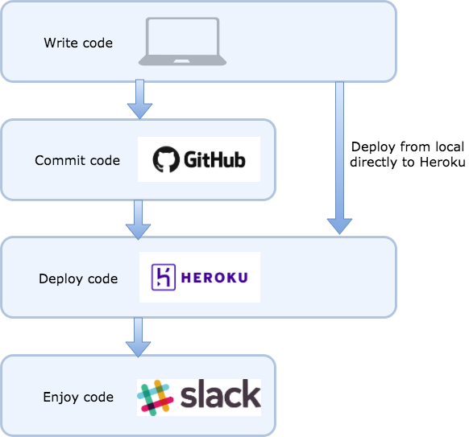

# Hey Fireball

## Overview

Hey Fireball is an open source project to clone a popular Slack bot that allows users in a team to reward each other by handing out a certain emoji.  The original design of Hey Fireball was around an emoji of a Fireball Whisky bottle `:fireball`:, but is designed to accomodate any emoji that fits your teams personality.

## Usage

You can test it out during the demo on the STL Tech Slack in the channel `#hey_fireball`.  [Click here to join the STL Tech Slack.](https://stltech.herokuapp.com/)

@user :fireball: :fireball:

## Deployment

This github repo is currently set up to deploy to Heroku.  We've successfully deployed this on a free tier and with a verified account, there are enough hours to run the bot continuously.

### Environmental Variables
Hey Fireball relies on several environmental variables for a successful deployment.

- **STORAGE_TYPE**: string denoting which storage type to use.  The types currently supported are `inmemory` (default) and `azuretable`).  Other storage models can be supported by subclassing the `Storage` class and implementing the necessary methods.
- **BOT_ID**: The slack `BOT_ID` to use.  The enclosed script `print_bot_id.py` will help you obtain this using the `SLACK_BOT_TOKEN` received from Slack when you create a bot.
- **EMOJI**: The slack emoji on your team you want your bot to pickup, for Hey Fireball we used `:fireball:` which is a custom emoji specific to our team.
- **POINTS**: The term you call your "points" by.  For Hey Fireball, we used `shots`, but you can define this to be whatever you want.
- **SELF_POINTS**: A flag that allows people to give themselves points.  Set to `DISALLOW` (default) to prevent users from giving themselves points, set to (literally) anything else and it will allow users to give themselves points. 

### Walking through deployment to Heroku

- Get [Slack](https://slack.com/)
  - Create Slack Bot for team (appropriate permissions are needed, you won't have them for STL Tech)
  - Save the `SLACK_BOT_TOKEN` somewhere handy 
- Get `BOT_ID`
  - Set `SLACK_BOT_TOKEN` as an environmental variable (on Macs it's `export SLACK_BOT_TOKEN="blah"`, on Windows it's `set SLACK_BOT_TOKEN="blah"`) where `blah` is obviously your saved token from before
- Create or login to [Heroku](https://heroku.com) account
  - Link to github repo
  - Set environmental variables
  - Optionally enable continuous integration from Github for automatic pushes to Heroku
